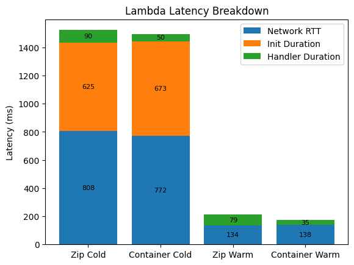
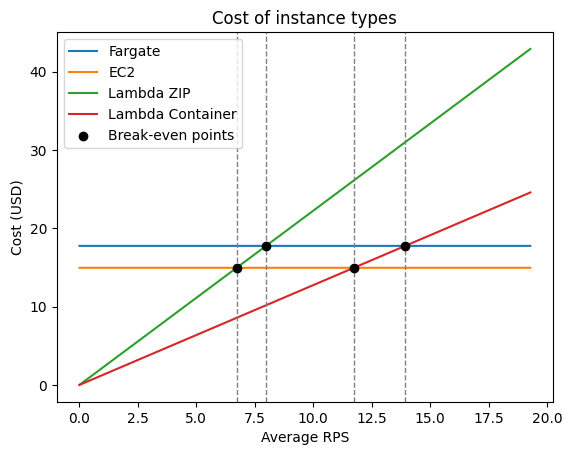

# AWS Cloud Lab - Serverless vs Containers: Latency and Cost Comparison
The aim of this lab was to compare latencies and costs of three AWS execution environments - Lambda, Fargate, and EC2 - running the same workload under different traffic patterns. After gathering all specified measurements, a recommendation should be formed regarding what environment should be chosen for unpredictable and spiky traffic and an SLO of p99 < 500ms and what changes would be needed to optimize it. 

## Scenario A - Cold Start Characterization
After deploying all targets using provided scripts and all other necessary setup and waiting 20 minutes for all Lambda instances to go idle, latency benchmarks were ran using `scenario-a.sh` script. After the script finished, the `oha` benchmark results and Cloudfront logs were saved to text files. Using the data stored in them, the Lambda latency analysis was performed inside `scenario-a-analysis.ipynb` Jupyter notebook. As a result of it, the following stacked bar chart was created:



As visible in the above figure, the cold start latency of Lambda is enormous, reaching around 1.5 seconds in both cases. In subsequent requests, the latency is much smaller. The increased network RTT for cold starts partly stems from the need to perform the the TCP dialup, which took around 270 ms. Because these values are identical for average, fastest, and slowest values, it looks like this dialup was performed only once and the connection was then reused for other requests.

From the data, container-based Lambda functions have faster invocation times compared with the zip-based ones. This may stem from the container having already pre-loaded dependencies and pre-filled cache after the first invocation. On the other hand, the init duration is slightly longer for containers in comparison with zip-based Lambdas. This may stem from the zip file being simpler having simpler setup compared with container images. Regardless, the container-based cold start was overall faster than zip-based cold start as the handler duration took almost twice as long.

## Scenario B - Warm Throughput
Latency benchmarks were ran using `scenario-b.sh` script, which warmed up the endpoints before issuing requests. After the script finished, the `oha` benchmark results were saved to text files. Using that data, the table specified by the lab script was filled out:

| Environment        | Concurrency | p50 (ms) | p95 (ms) | p99 (ms) | Server avg (ms) |
|--------------------|-------------|----------|----------|----------|-----------------|
| Lambda (zip)       | 5           | 209      | **227**  | **463**  | 212             |
| Lambda (zip)       | 10          | 204      | **230**  | **464**  | 205             |
| Lambda (container) | 5           | 204      | **234**  | **467**  | 209             |
| Lambda (container) | 10          | 200      | **222**  | **472**  | 206             |
| Fargate            | 10          | 811      | 1104     | 1285     | 845             |
| Fargate            | 50          | 4193     | 4492     | 4609     | 4029            |
| EC2                | 10          | 293      | 364      | 406      | 301             |
| EC2                | 50          | 907      | 1135     | 1298     | 902             |

The cells with bold text contain values, where `p99 > 2*p95`, which signal tail latency instability. This seems to be a characteristic of Lambda as Fargate and EC2 doesn't show that behavior. Regardless, Lambda has the lowest average latency across all cases, though the maximal concurrency limit is 5 times lower for Lambda than Fargate and EC2. Because of that, the only comparable rows are for 10 concurrent request.

Contrary to Fargate and EC2, Lambda functions show the behavior of high parallelism, because the `p50` value barely changes between 5 and 10 concurrent requests. This is because each Lambda invocation is executed in a separate environment, while Fargate and EC2 use a request queue.

One may also notice that the `query_time` field's value in payload is different from `oha`'s `p50` results. The difference comes from the additional network delay, which is significant when transferring data from the eastern USA to central Europe.

## Scenario C - Burst from Zero
After waiting 20 minutes for all Lambda instances to go idle, latency benchmarks were ran using `scenario-c.sh` script. After the script finished, the `oha` benchmark results were saved to text files.

After reading these files, it was noticed that the `p99` metric value was the smallest for EC2 instance (1.1869s), then Lambda instances (1.3968s and 1.6510s), and the largest for Fargate instances (4.6012s). The advantage of EC2 comes from the environment being immediately ready to receive requests, while Lambda instances needed to warm up. The case of Fargate instance is interesting and it could be explained by extensive resource use.

Expanding analysis for Lambda instances, the following bimodal peaks were identified:

| Environment        | Cold-start (s) | Warm instance (s) |
|--------------------|----------------|-------------------|
| Lambda (zip)       | 1.677          | 0.350             |
| Lambda (container) | 1.373          | 0.318             |

As observed, the cold-start instance takes between 4 and 5 times longer to respond than a warm instance. This is significant, because given the described scenario, the `p99 < 500ms` SLO is not achieved. To maintain the objective, periodic requests to the Lambda instance should be performed to keep it away from going idle.

## Cost at Zero Load
Analyzing the costs of specified instances without including the load, it was noticed that Lambda instances are billed only when they are invoked. That means the costs of idle Lambda environments is zero. As for EC2 instances, the cost of `t3.small` instance, assuming it is active 6 hours a day, is $3.74 monthly and $45.55 yearly. As for Fargate instance with the same assumptions, it costs $4.44 monthly and $54.06 yearly. The cost is increased probably because Fargate instances do not need to be managed on OS-level by the user.

## Cost Model, Break-Even, and Recommendation
In this analysis, I will use the provided traffic model:
- Peak: 100 RPS for 30 minutes/day
- Normal: 5 RPS for 5.5 hours/day
- Idle: 18 hours/day (0 RPS)

For Lambda cost calculations, we will use the following cost formula:
```
Monthly cost = (requests/month × $0.20/1M) + (GB-seconds/month × $0.0000166667)
GB-seconds   = requests × duration_seconds × memory_GB
```

Given the traffic model above, it can be calculated that the total number of requests per day is $100 \times 30 \times 60 + 5 \times 5.5 \times 60 \times 60 = 279000$, which equals around 16740000 requests per month or 6.56 RPS on average.

### Lambda ZIP
The median billed duration for requests is around 0.079 s and uses 0.5 GB of memory. This means the `GB-seconds/month` value for Lambda ZIP equals $16740000 \times 0.079 \times 0.5 = 661230$. Using that value, we can calculate that the total monthly cost of Lambda ZIP invocations is $16740000 \times 0.2 \div 1000000 + 661230 \times 0.0000166667 = 14.37$ USD. The cost of cold-start requests is omitted in this calculation as it should only occur once a day and is not significant enough to change the result.

### Lambda Container
The median billed duration for requests is around 0.035 s and uses 0.5 GB of memory. This means the `GB-seconds/month` value for Lambda ZIP equals $16740000 \times 0.035 \times 0.5 = 292950$. Using that value, we can calculate that the total monthly cost of Lambda ZIP invocations is $16740000 \times 0.2 \div 1000000 + 292950 \times 0.0000166667 = 8.23$ USD. The cost of cold-start requests is omitted in this calculation as it should only occur once a day and is not significant enough to change the result.

### Fargate
The cost of Fargate instance is constant regardless of traffic, so using above calculations we can state that it will cost 17.76 USD per month if left always-on, otherwise it's 4.44 USD if it's available for only 6 hours a day.

### EC2
The cost of EC2 instance is constant regardless of traffic, so using above calculations we can state that it will cost 14.96 USD per month if left always-on, otherwise it's 3.74 USD if it's available for only 6 hours a day.

### Break-even RPS
The cost formula given above is a function, which takes the number of requests per month as an argument and returns the monthly cost in USD. We can transform the provided equation to achieve a function which takes the monthly cost as input and returns the number of requests per month:

$$
c = r \times 0.2 \div 1000000 + r \times t \times 0.5 \times 0.0000166667 \\
c = r \times (0.2 \div 1000000 + t \times 0.5 \times 0.0000166667) \\
r = \frac{c}{0.0000002 + t \times 0.5 \times 0.0000166667}
$$

Using the provided equation with parameters $t_z = 0.079$ and $t_c = 0.035$, we can calculate the following break-even monthly requests number:

| Instance | Lambda ZIP | Lambda Container |
|----------|------------|------------------|
| EC2      | 17429100   | 30427082         |
| Fargate  | 20691230   | 36121991         |

Converting to RPS, we get the following values:

| Instance | Lambda ZIP | Lambda Container  |
|----------|------------|-------------------|
| EC2      | 6.72 RPS   | 11.73 RPS         |
| Fargate  | 7.98 RPS   | 13.94 RPS         |

Using the above calculations, we can create the following cost comparison charts:



### Recommendation
Given the provided SLO (p99 < 500 ms) and the traffic model, I recommend using Lambda with container deployment. The recommendation fits the traffic model perfectly, because Lambda has high scaling ability due to being a serverless solution and zero cost while not used.

During scenario C, in the majority of cases (p90), the response time is under 0.2258 seconds, which was not matched by any other solution. As for the cold-start cases, we can avoid them by periodically invoking the endpoint, for example every 10 minutes. In that case, meeting the mentioned SLO should be possible while maintaining low service costs.

The recommended solution also is the most economical one, as it costs only 8.23 USD per month, which is negligible at this scale. We can even double the number of requests sent to Lambda and it should still be cheaper than Fargate or EC2, even if we do not account for the need to raise resource allocation for these instances. 